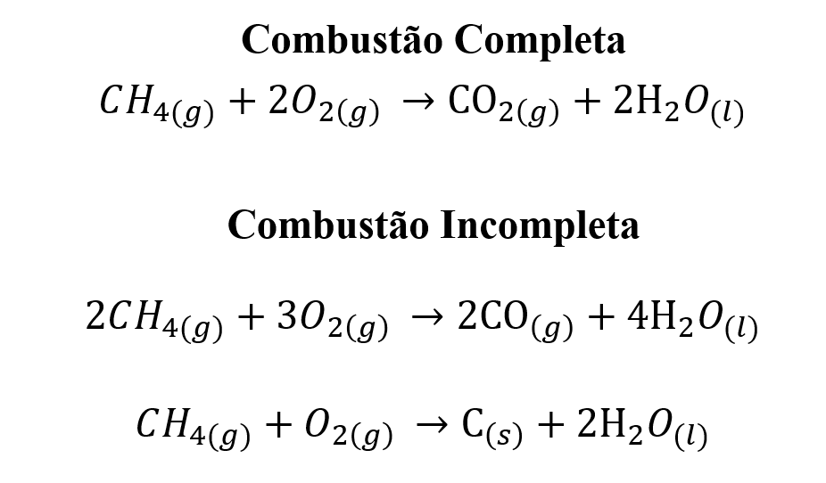

# Monóxido de Carbono
Projeto Fundamentos da Engenharia - IMT - 1º ano.
  
<h2>Impactos causados:</h2>
O monóxido de carbono é um poluente atmosférico que resulta principalmente da queima incompleta de combustíveis fósseis. Sua presença no ar contribui para a poluição urbana, criando problemas de qualidade do ar, especialmente em grandes cidades. Desse modo, o CO é um gás tóxico, ele se liga à hemoglobina no sangue com maior afinidade que o oxigênio, dificultando a circulação de oxigênio para os órgãos e tecidos. Isso pode causar: 

- Sintomas de envenenamento por CO☠️: Fadiga, dor de cabeça, tontura, náusea e, em níveis elevados, até perda de consciência ou morte. 
- Exposição em Ambientes Fechados🚪: Em áreas com combustão inadequada (como carros, aquecedores ou fogões), o CO pode se acumular em ambientes fechados, colocando em risco a saúde das pessoas que ali residem. 
 A poluição do ar, que inclui o CO, pode contribuir para uma sensação de degradação da qualidade de vida em áreas urbanas densamente povoadas. O céu encoberto pela poluição, a falta de visibilidade e o aumento da poluição sonora podem afetar o bem-estar psicológico e visual das pessoas. 

<h2>Como é liberado monóxido de carbono no ambiente?</h2>

Para sabermos como libera primeiro precisamos entender como funciona a combustão. A combustão é uma reação química que ocorre entre uma substância combustível (como madeira, papel, álcool, gasolina) e um comburente (geralmente o oxigênio do ar), liberando energia na forma de calor e luz. O comburente é a substância que fornece o oxigênio necessário para que a combustão aconteça, sem o comburente o combustível não queima. Na maioria das situações, o oxigênio (O₂) presente no ar é o comburente.

<h2>Combustão Completa x Combustão Incompleta</h2>

<h3>🔥 O que é combustão completa?</h3>
 A combustão completa acontece quando há oxigênio suficiente para queimar todo o combustível.
Nessa reação, o carbono (C) do combustível se transforma totalmente em dióxido de carbono (CO₂).

Características:
- Fumaça quase invisível;
- Chama azulada;
- Produz mais energia;
- Menor poluição.

<h3>🔥 O que é combustão incompleta?</h3>
 A combustão incompleta ocorre quando falta oxigênio na reação.
Nesse caso, o carbono não se queima totalmente, e são formados gases tóxicos, como monóxido de carbono (CO), ou até mesmo carvão (fuligem).

Características:
- Fumaça escura ou preta
- Chama amarelada ou alaranjada
- Produz menos energia
- Libera poluentes tóxicos

<h2 align="center">Fórmula estequiométrica da combustão completa e incompleta:</h2>

   

<h2>Componentes usados para detectar CO</h2>
Para conseguir detectar o monóxido de Carbono(CO) foram usados o Esp32, display e sensor MQ-7.

<h3>Esp32</h3>

<h3>Display</h3>

<h3>Sensor MQ-7</h3>

